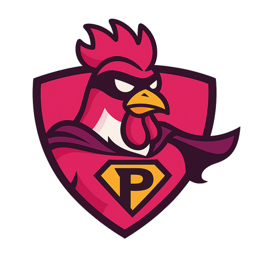

<div align="center">



# PinkRooster

**Tool collections for AI agents on the Microsoft Agent Framework: a class that holds a tool's methods, its prompt text and its live state. Plus an agent builder and MCP, on .NET 10.**

[](https://github.com/pinkroosterai/PinkRooster/actions/workflows/ci.yml)
[](https://www.nuget.org/packages/PinkRooster.Agents)
[](LICENSE)
[](https://dotnet.microsoft.com/)

[The idea](#the-idea) · [Quickstart](#quickstart) · [Packages](#packages) · [Samples](#samples) · [FAQ](#faq) · [Contributing](#feedback-contributing-and-license)

</div>

---

PinkRooster is a set of .NET libraries for building LLM agents on the
[Microsoft Agent Framework](https://learn.microsoft.com/agent-framework/) (MAF). You keep MAF's agent, sessions and workflows. The libraries add:

- **Tool collections.** One class holds a group of tools *and* everything the model needs to use them well. This is the core of the project.
- **An agent builder.** A fluent way to say what the agent is: a system prompt built from named sections, with checks that fail early.
- **Events.** One typed stream of everything the agent does: reasoning, answer text, tool calls, approvals, steps.
- **Background tools.** The model starts a slow tool call, such as a build or a sub-agent, goes on, and reads the result when it is ready.
- **Ready-made tools and MCP.** Shell, files, ask-the-user, task list and any MCP server.

Six NuGet packages, released together; install only what you need. Bring any `IChatClient`: OpenAI, Azure, Ollama, LM Studio.

## The idea

An agent's tools are never only code. A shell tool also needs a rule ("never run `rm -rf`"). A ticket tool needs a note on how ticket numbers look
and what is open *right now*. A destructive tool needs a human to say yes. In most setups these live in three places: a function somewhere, a
sentence in a system prompt somewhere else, and an approval hook in a third. They drift apart.

A **tool collection** puts them in one class:

| It carries | So the model gets |
|---|---|
| `[Tool]` methods | the tools, with names, descriptions and typed parameters |
| standing instructions and constraints | lines in the system prompt that appear exactly when the tools do |
| `GetContextAsync` | a short note on the tools' *current state*, fresh before every model call |
| `RequiresApproval` | a human decision before a dangerous tool runs |

Add the class to an agent and all four arrive together. Remove it and all four leave. The same applies to ready-made collections, to an MCP
server's tools, and to plain `AIFunction`s from anywhere. The [tool collections guide](docs/PinkRooster.ToolCollections.md) shows a full example
and exactly what the model receives.

## Quickstart

You need the .NET 10 SDK and an `IChatClient` for the model you want to use.

```text
dotnet add package PinkRooster.Agents --prerelease
dotnet add package PinkRooster.ToolCollections.BuiltIn --prerelease
```

<!-- quickstart:begin -->
```csharp
using PinkRooster.Agents;
using PinkRooster.ToolCollections.BuiltIn.Shells;

var agent = chatClient
    .CreateAgent()
    .WithRole("You are a build assistant for this repository.")
    .WithTools(new ShellToolCollection())
    .Build();

var response = await agent.RunAsync("Does the solution build?");
Console.WriteLine(response.Text);
```
<!-- quickstart:end -->

`chatClient` is any `IChatClient`; the [agent guide](docs/PinkRooster.Agents.md#quickstart) shows how to make one for Ollama, LM Studio or another OpenAI-compatible server. `Build()` returns a normal MAF `AIAgent`. The shell tool runs commands without asking unless you call
`RequireApproval("RunShell")`; see the [built-in tools guide](docs/PinkRooster.ToolCollections.BuiltIn.md).

## Packages

| I want to… | Package | Guide |
|---|---|---|
| Write my own tools as a class, with instructions and live context | `PinkRooster.ToolCollections` (comes with `PinkRooster.Agents`) | [guide](docs/PinkRooster.ToolCollections.md) |
| Build an agent with the fluent builder, agent classes and run events | `PinkRooster.Agents` | [guide](docs/PinkRooster.Agents.md) |
| Use a ready-made shell, files, ask-the-user, task-list, date/time or image-question tool | `PinkRooster.ToolCollections.BuiltIn` | [guide](docs/PinkRooster.ToolCollections.BuiltIn.md) |
| Give an agent an MCP server's tools | `PinkRooster.ToolCollections.Mcp` | [guide](docs/PinkRooster.ToolCollections.Mcp.md) |
| See the reasoning of Ollama or Groq models through the OpenAI adapter | `PinkRooster.OpenAI.Reasoning` | [guide](docs/PinkRooster.OpenAI.Reasoning.md) |
| Show an agent's run, ask for tool-call approval and print its markdown answer in a Spectre.Console terminal | `PinkRooster.SpectreConsole` | [guide](docs/PinkRooster.SpectreConsole.md) |

`PinkRooster.Agents` depends on `PinkRooster.ToolCollections`, never the other way round. The libraries contain no model provider and no UI package, except two small adapters: `PinkRooster.OpenAI.Reasoning` is the only one that knows the OpenAI SDK and
`PinkRooster.SpectreConsole` the only one that knows Spectre.Console; a test enforces it. The packages depend on each other at an exact version and release together, so the
latest prerelease of each one matches the others.

`PinkRooster.Agents` supports MAF `[1.24.0, 1.25.0)`: each new MAF minor needs a release of every package here, because the step loop sits on
experimental MAF types. The agent guide says [why not MAF directly, or Harness](docs/PinkRooster.Agents.md#why-not-maf-directly-or-harness).

## Samples

[`samples/`](samples/README.md) holds one console project for each feature, beginning with [`Builder`](samples/PinkRooster.Samples.Builder/README.md)
and [`ToolCollections`](samples/PinkRooster.Samples.ToolCollections/README.md), and one shared library that sets up the model. They run against
Ollama by default.

## FAQ

**Does it work with Ollama, LM Studio or other OpenAI-compatible servers?** Yes. The libraries take any `IChatClient`; add
`Microsoft.Extensions.AI.OpenAI` to your app and point it at the endpoint.

**Can I use tool collections with an agent I already built?** Yes. `ToolCollectionContextProvider` gives collections to any MAF agent, including
`HarnessAgent`; see the [`PinkRooster.ToolCollections` guide](docs/PinkRooster.ToolCollections.md#agents-that-were-not-built-with-pinkroosteragents).

**How do I make the agent ask before running a command?** Call `RequireApproval("RunShell")` on the builder, or set `RequiresApproval = true` on a
`[Tool]`. The run ends with a `ToolApprovalRequestContent`; the [agent guide](docs/PinkRooster.Agents.md#approvals) shows how to send your answer back.

**Is the shell tool safe?** It has prefix lists (an allowlist, with a denylist for exceptions) and limits, which guard against mistakes; they are not a sandbox. Commands run with the
host's permissions and, by default, its environment. Require approval for anything that matters, and run the shell through a `Shell.Launcher` for a real boundary.

## Build and test

You need the .NET 10 SDK. From the repository root:

```text
dotnet build PinkRooster.slnx -c Release
dotnet test --solution PinkRooster.slnx -c Release
dotnet pack PinkRooster.slnx -c Release -o artifacts
```

The tests need no API key, model or server. The examples in the guides are compiled and run by the tests, so they do not go stale.

## Feedback, contributing and license

Found a bug or missing something? [Open an issue](https://github.com/pinkroosterai/PinkRooster/issues). See [CONTRIBUTING.md](CONTRIBUTING.md) for
development and pull requests, [SECURITY.md](SECURITY.md) for private vulnerability reporting, [CHANGELOG.md](CHANGELOG.md) for what changed, and
[LICENSE](LICENSE) for the MIT terms.
